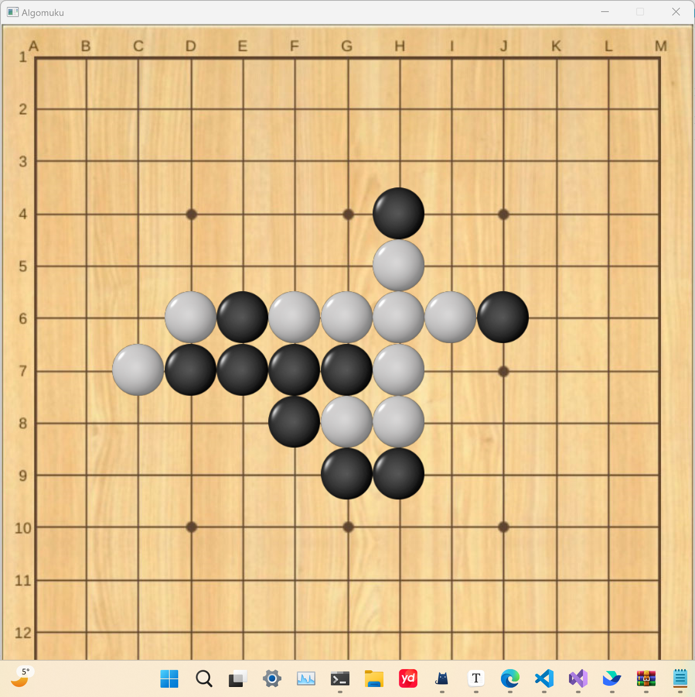
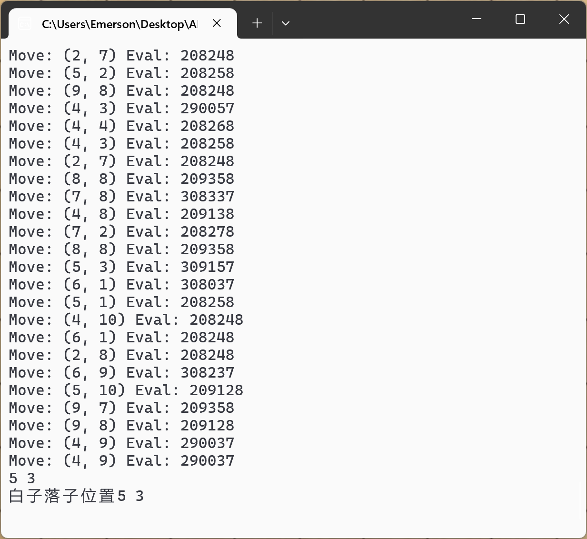

### 效果展示

#### AI正在计算评分

#### 实验目的

本实验的目的在于实现能够与人类进行博弈的AI，并在此过程中积累做项目的经验，初步接触AI算法。

#### 设计思路

| 类名      | 功能                                 |
| --------- | ------------------------------------ |
| ChessGame | 最顶层的封装，用于开始游戏           |
| Chess     | 控制棋盘的数据，实现落子、判断输赢等 |
| Man       | 人类方落子                           |
| AI        | 整个项目的核心，用于实现AI算法       |

接下来详细介绍AI的设计思路

AI的实现分为两大块：

1.寻找最佳位置

2.落子

其中，寻找最佳位置采用alphabeta算法进行深层搜索，以此提高AI算法的准确率和胜率；并采用启发式搜索在评分前先对各个点进行初步评分，从而减少不必要的计算，进而优化性能。

#### 实现

##### alphabeta算法

alphabeta算法的实现很简单，这是一套固定的模板，关键在于理解算法的思想，搞明白为什么beta <= alpha时可以剪枝。最重要的反而是递归出口处最不起眼的评估函数，它是一个AI智能水平的关键。

我在这里有一个优化，利用`availableMoves`数组存储棋盘上所有的空位，并随着棋局的进行实时更新。因为随着棋盘上棋子的增多，会出现大量的非空位置，如果直接遍历，会消耗大量的时间，而`availableMoves`可以保证每次判断的位置都是空位，从而优化性能，提高AI的落子速度。

##### 启发式搜索

启发式搜索的思想是：在评分前先对各个点进行初步评分，从而减少不必要的计算，进而优化性能。

在此次项目中，根据五子棋“五子连珠则游戏胜利”的特性，我采用了一个非常巧妙的做法，即加入一个`hasNeighbour`，用于判断以该位置为中心的3x3的区域内是否有棋子。因为若旁边3x3的区域内没有棋子，那么在此处落子既不能实现进攻，也不能实现防守，没有任何价值。因此，在`findBestMove`函数中，只对那些周围有棋子的位置进行打分，其他的位置由于评分必然比周围有棋子的位置低，直接剪枝，忽略不计。

棋局开始时，场上有大量的空白，用这样的方法可以大大提高AI搜索的效率，使落子速度大大提升。例如，开局黑子落定，第一层只需要对黑子周围的八个空位打分，第二层在第一层的基础之上，只需对周围的10或12个位置进行打分，这样AI计算的效率大大提升。

##### 评分函数

最开始我的想法是遍历棋盘的每个位置，若此处有子，则对其周围八个方向的落子情况进行判断，再根据落子情况进行打分。

很显然，这个方法有个致命的缺陷，即每个子会被判断不止一次，从而对同一个情形进行多次打分，影响AI的正确判断。例如，现在场上有多个活二，每个活二由于有两个子，所有每个活二都会被计算两次；另一种情形中，成功实现了活四，只差一步即可胜利；以我们的视角来看，第二种情形肯定是优于第一种情形的，但由于前文所言的反复打分的情况，只要活二足够多，第一种情形的评分可能反而超过第二种情形，从而导致AI下出很坏的棋。

我曾经多次更改打分系统，希望能够克服这个缺陷，但由于反复打分的复杂性，很难去预测结果，最终，此方案被废弃。然后，就有了如今的更清晰，更易于维护的打分系统。

现在的打分系统的整体思路是，按四个方向遍历棋盘，然后将当前情形与棋谱进行比较，这样就有效避免了一种情形被多次计算的情况。例如，在当前的评分系统中，活二只会被计算一次，因为棋谱是有方向地进行比照的，当前满足活二，下一步之后计算的起点向右移动，则不满足活二了，从而保证每种情形只被计算一次。

并且，这样的做法也方便对评分系统进行维护和优化，因为在发现AI下出令人不满意的棋之后，可以直接比对棋谱，提高想要的局面的打分，从而让AI的棋力提高。

我设置了两组棋谱，因为在白方黑方下的时候，场上的评分是不同的。例如，棋盘上白方出现了一个死四（四个白子连在一起），如果此时轮到白方，那么直接就赢了，评分很高；而假如此时轮到黑棋，黑棋必然围堵，评分就很低。所以根据实际情况设置两个不同的评分系统可以更好地对局面进行打分。

##### 总结

AI五子棋终于告一段落了！

尽管目前功能还不完善，AI也没那么聪明，但毕竟这是倾注了自己心血的项目。一个函数一改可能就是一天，吃饭走路睡觉时想着的也是如何去实现某个功能，然后尝试，失败，再尝试，再失败，直到这项功能实现为止。

最终留下的代码只有几百行，但写过的人才知道，若算上尝试的过程中废弃的代码，体量将是现在的数倍。

感谢各位前辈的开源分享，让我前进的道路有迹可循；感谢数据结构A班的众多大佬，让我认识自己的不足，从而奋力追赶。今后我也会继续努力，努力实现我那成为技术大佬的遥远理想。加油，追梦人！

##### 

